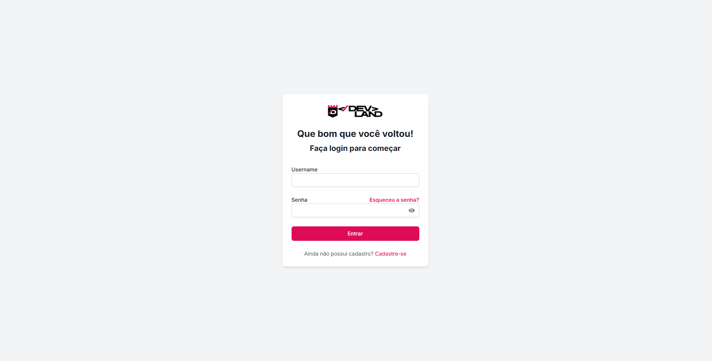

# Blackjack Multiplayer 🂡🂱

Aplicação web de **Blackjack** em tempo real, construída com **Next.js 14**, **React 18** e **TypeScript**. Permite criar ou entrar em salas privadas, apostar fichas virtuais, jogar contra amigos online e acompanhar o ranking geral de jogadores.

## Índice
1. [Visão Geral](#visão-geral)
2. [Principais Funcionalidades](#principais-funcionalidades)
3. [Tecnologias Utilizadas](#tecnologias-utilizadas)
4. [Instalação e Execução Local](#instalação-e-execução-local)
5. [Variáveis de Ambiente](#variáveis-de-ambiente)
6. [Estrutura de Pastas](#estrutura-de-pastas)
7. [Scripts Disponíveis](#scripts-disponíveis)
8. [Prints de Tela](#prints-de-tela)
9. [Contribuindo](#contribuindo)
10. [Licença](#licença)

## Visão Geral
Este projeto foi desenvolvido com o objetivo de praticar conceitos modernos de desenvolvimento web full-stack, tais como Server Actions, autenticação com NextAuth e comunicação em tempo real via WebSockets. O jogo implementa as regras clássicas do Blackjack (ou **21**) e mantém o estado das partidas sincronizado entre todos os participantes.

## Principais Funcionalidades
- Autenticação de usuários (e-mail/senha ou provedores OAuth) usando NextAuth.js.
- Criação de salas privadas com senha opcional.
- Convidar amigos por link compartilhável.
- Apostas com fichas virtuais e ranking global dos maiores stackers.
- Feedback em tempo real utilizando **socket.io**.
- UI responsiva construída com Tailwind CSS e DaisyUI.

## Tecnologias Utilizadas
- **Next.js 14** (App Router, Server Actions, Route Handlers)
- **React 18** + **TypeScript**
- **NextAuth.js** para autenticação
- **Socket.IO** para comunicação em tempo real
- **Tailwind CSS** + **DaisyUI** para estilização
- **React-Toastify** para notificações
- **ESLint** & **Prettier** para qualidade de código

## Instalação e Execução Local
```bash
# 1. Clone o repositório
$ git clone https://github.com/PatsFerrer/games.blackjack.site.git && cd games.blackjack.site

# 2. Instale as dependências
$ npm install      # ou yarn, pnpm, bun

# 3. Configure as variáveis de ambiente (ver seção abaixo)

# 4. Inicie o servidor de desenvolvimento
$ npm run dev

# Acesse http://localhost:3000 no seu navegador.
```

Para gerar a versão de produção:
```bash
npm run build
npm start
```

## Variáveis de Ambiente
Crie um arquivo `.env.local` na raiz do projeto seguindo o modelo abaixo:
```env
# NextAuth
NEXTAUTH_SECRET=uma_chave_segura
NEXTAUTH_URL=http://localhost:3000

# Exemplo de provedor OAuth
# GITHUB_ID=xxxxxxxxx
# GITHUB_SECRET=yyyyyyyyy
```
Ajuste os valores conforme o provedor de autenticação que você escolher.

## Estrutura de Pastas
```
src/
  app/            # Páginas (App Router) e Server Actions
  components/     # Componentes reutilizáveis
  context/        # Context API
  utils/          # Funções utilitárias
public/           # Imagens e assets estáticos
```

## Scripts Disponíveis
| Comando        | Descrição                                   |
| -------------- | ------------------------------------------- |
| `npm run dev`  | Inicia o servidor de desenvolvimento        |
| `npm run build`| Cria o build de produção                    |
| `npm start`    | Executa o build em modo produção            |
| `npm run lint` | Analisa o código com ESLint                 |

## Prints de Tela
> Substitua os caminhos das imagens abaixo pelos prints reais após capturá-los.

### Login


### Lobby de Salas


### Aposta e Fichas


### Mesa de Jogo


### Ranking


## Licença
Distribuído sob a licença MIT. Veja `LICENSE` para mais detalhes.
